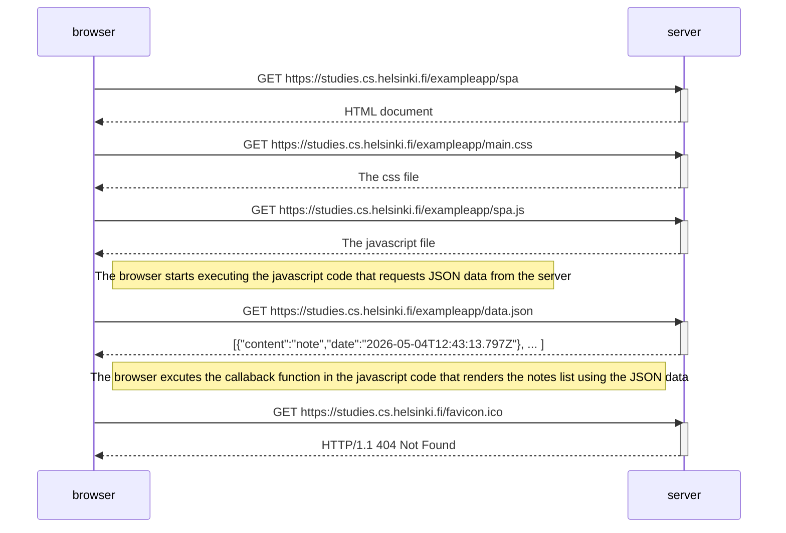

```mermaid
sequenceDiagram
    participant browser
    participant server

    browser->>server: GET https://studies.cs.helsinki.fi/exampleapp/spa
    activate server
    server-->>browser: HTML document
    deactivate server

    browser->>server: GET https://studies.cs.helsinki.fi/exampleapp/main.css
    activate server
    server-->>browser: The css file
    deactivate server

    browser->>server: GET https://studies.cs.helsinki.fi/exampleapp/spa.js
    activate server
    server-->>browser: The javascript file
    deactivate server

    Note right of browser: The browser starts executing the javascript code that requests JSON data from the server

    browser->>server: GET https://studies.cs.helsinki.fi/exampleapp/data.json
    activate server
    server-->>browser: [{"content":"note","date":"2026-05-04T12:43:13.797Z"}, ... ]
    deactivate server

    Note right of browser: The browser excutes the callaback function in the javascript code that renders the notes list using the JSON data

    browser->>server: GET https://studies.cs.helsinki.fi/favicon.ico
    activate server
    server-->>browser: HTTP/1.1 404 Not Found
    deactivate server
```
